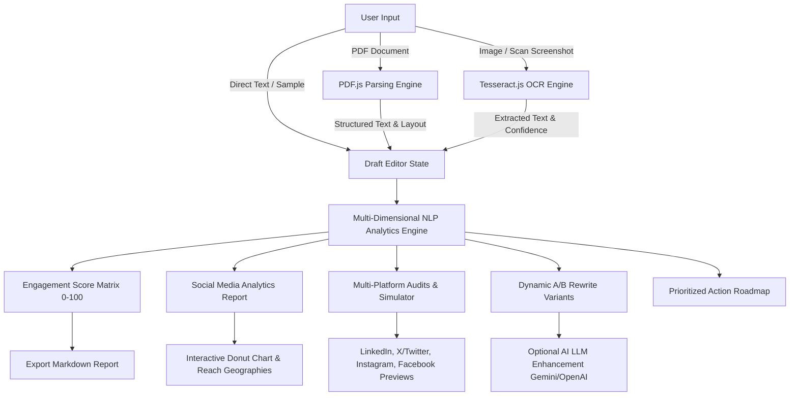

# 🏛️ System Architecture & Technical Design

**Project:** Social Media Content Analyzer & Optimizer (`SocialSense AI`)  
**Technology Stack:** React 19, TypeScript, Vite, Tailwind CSS v4, PDF.js, Tesseract.js, Lucide Icons

---

## 1. High-Level Data Flow

---

## 2. Component Pipeline Details

### A. Text Extraction Engine (`src/services/pdfParser.ts` & `ocrService.ts`)
- **PDF Extraction**:
  - Uses `pdfjs-dist` to iterate across document pages.
  - Computes vertical coordinate differentials (`deltaY > 12px`) between text tokens to accurately preserve paragraph breaks and heading hierarchy rather than collapsing text into a single line.
- **OCR Engine**:
  - Spawns a dedicated Web Worker via `tesseract.js`.
  - Streams progress callbacks (`recognizing text: 0% -> 100%`) to drive UI loading indicators.
  - Normalizes line feeds (`\r\n` -> `\n`) and filters OCR noise.

### B. NLP Content & Engagement Scoring Matrix (`src/services/analyzerService.ts`)
The aggregate **Engagement Score (0–100)** is computed using weighted heuristic models:

$$\text{Overall Score} = 0.25 \times \text{Hook} + 0.20 \times \text{Clarity} + 0.20 \times \text{CTA} + 0.20 \times \text{Emotion} + 0.15 \times \text{Formatting}$$

| Component | Weight | Metric Measured |
| :--- | :--- | :--- |
| **Hook Strength** | 25% | First line archetype (Question, Statistic, Bold Claim, Story) and scroll-stopping tension. |
| **Clarity & Readability** | 20% | Flesch-Kincaid Reading Ease ($206.835 - 1.015 \times \text{ASL} - 84.6 \times \text{ASW}$) and sentence length. |
| **Call to Action (CTA)** | 20% | Explicit engagement triggers (question asking, bookmarking, sharing, commenting). |
| **Emotional Resonance** | 20% | Power words, inspiration/authority terms, sentiment polarity. |
| **Visual Formatting** | 15% | Paragraph spacing, bullet usage, mobile scan velocity. |

### C. Social Media Analytics Report Model
Simulates reach and engagement based on draft quality:
- **Total Projected Reach**: Scaled linearly with score ($18,000 + (\text{Score}/100) \times 32,000$).
- **Projected Engagement Rate**: Between $1.8\%$ and $5.6\%$.
- **Interaction Breakdown**:
  - Reactions ($65\%$)
  - Comments ($18\%$)
  - Shares/Reposts ($11\%$)
  - Saves & Follows ($6\%$)
- **Audience Geographies**: Top regions by distribution (US 42%, UK 28%, Germany 14%, Canada 9%, APAC 7%).

### D. Multi-Platform Compliance Engine
- **LinkedIn**: Analyzes 800–1,500 character sweet spot, 3–5 hashtag policy, dwell time formatting.
- **Twitter / X**: 280-character strict limit gauge, 1–2 tag policy, thread conversion suggestions.
- **Instagram**: First 125-character cut-off check before "...more" truncation, hashtag cluster guidance.
- **Facebook**: Question triggers and conversational commentary signals.

---

## 3. Privacy, Security & Offline Resilience

1. **Client-Side Processing**: All PDF parsing and OCR text extraction happen directly inside the user's browser sandbox. No user files or documents are transmitted to external servers.
2. **Zero Mandatory Backend Requirement**: The application operates fully standalone offline without requiring paid third-party infrastructure.
3. **Optional AI Key Storage**: If the user provides a Google Gemini or OpenAI API key, it is stored strictly in `localStorage` and sent only to official endpoints.
