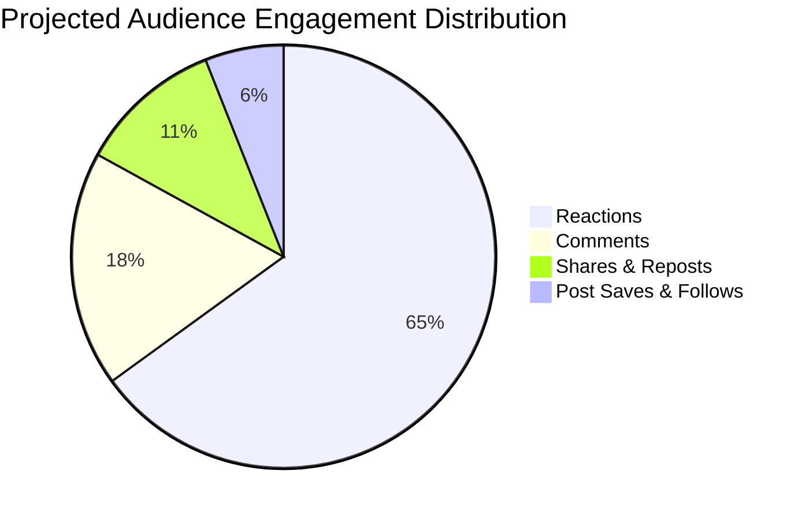

# SocialSense AI - Social Media Content Analyzer & Optimizer

A modern, production-ready web application that extracts text from PDF documents and images/scans (via OCR) to analyze social media posts, calculate multi-dimensional engagement scores, and suggest algorithmic engagement improvements.

---

## Project Overview

SocialSense AI solves the challenge of optimizing social media drafts before publishing. Whether you upload a PDF marketing brief, a scanned flyer, an infographic screenshot, or directly type a draft, the analyzer extracts text, evaluates its viral potential, and outputs actionable platform-specific recommendations.

---

## Projected Audience Engagement Report

The application includes an interactive analytics projection engine that models audience distribution, reach, and interaction breakdowns:



### Engagement Metrics Overview

| Metric | Typical Simulation | Algorithmic Impact |
| :--- | :--- | :--- |
| **Reactions** | ~65% of interactions | Rapid feedback signal to feed algorithms |
| **Comments** | ~18% of interactions | Highest positive signal for LinkedIn & Facebook reach |
| **Shares / Reposts** | ~11% of interactions | Primary driver for viral exponential distribution on Twitter/X |
| **Post Saves & Follows** | ~6% of interactions | Key signal for Instagram Explore & high-intent audiences |

---

## Key Features

### 1. Document Upload & Extraction
- **Drag-and-Drop & File Picker**: Intuitive interface with visual feedback and format validation.
- **PDF Text Parsing**: Multi-page PDF text extraction powered by `pdfjs-dist` preserving line breaks, paragraph structure, and formatting.
- **Optical Character Recognition (OCR)**: High-accuracy OCR engine powered by `tesseract.js` for images (PNG, JPG, WEBP, scanned documents) with real-time stage and percentage progress indicators.
- **Pre-Loaded Test Samples**: One-click test posts (SaaS launch, leadership story, scanned flyer, unoptimized draft).

### 2. Content Analysis & Engagement Scoring (0-100)
- **Composite Score Engine**: Evaluates posts across 5 key pillars:
  - **Opening Hook Punchiness** (0-25 pts)
  - **Readability & Flesch-Kincaid Ease** (0-20 pts)
  - **Call to Action (CTA) Clarity** (0-20 pts)
  - **Tone & Emotional Resonance** (0-20 pts)
  - **Visual Layout & Spacing** (0-15 pts)
- **Tone & Sentiment Profiling**: Detects primary/secondary tone (Thought Leadership, Inspirational, Promotional, Urgent, Conversational) and sentiment valence.
- **Hook Analysis**: Categorizes hooks (Curiosity Question, Statistical/Data, Bold Claim, Story/Anecdote) and provides alternative suggestions.
- **Hashtag Intelligence**: Analyzes existing tag density and generates relevant high-reach hashtags.

### 3. Social Media Analytics Report (Projected Reach & Donut Chart)
- **Projected Engagement**: Reactions, Comments, Shares/Reposts, Post Saves, and Follower Growth.
- **Key KPIs**: Total Estimated Reach and Predicted Engagement Rate (%).
- **Interactive Donut Chart**: Visual distribution across reactions, comments, shares, and saves.
- **Audience Geographies**: Top regions by reach (United States 42%, United Kingdom 28%, Germany 14%, Canada 9%, APAC 7%).

### 4. Multi-Platform Algorithm Audits & Live Previews
- **Platform-Specific Optimization**:
  - **LinkedIn**: 800-1,500 character sweet spot, 3-5 tags, dwell-time boosting spacing.
  - **Twitter / X**: 280-character limit counter, thread conversion hints, 1-2 tag policy.
  - **Instagram**: First 125-char cutoff check before "...more", visual spacing, hashtag clusters.
  - **Facebook**: Conversational flow and comment drivers.
- **Realistic Mockup Previews**: Live visual social card simulator with engagement buttons.

### 5. A/B Optimization Variants & AI Rewrites
- Generates 4 tailored rewrite formulas:
  1. **Viral & Punchy Hook** (+45% Reach)
  2. **Thought Leadership & Story** (+60% Dwell Time)
  3. **Scannable Bullets & Takeaways** (+35% Saves & Reposts)
  4. **Community Discussion Driver** (+80% Comments)
- **Optional AI Connect**: Zero-backend support for Google Gemini (Free tier) and OpenAI API keys stored strictly in browser local storage.

### 6. Reporting & UX Polish
- **Export Markdown Report**: Complete audit download for sharing with clients and marketing teams.
- **Responsive Modern Light UI** built with Tailwind CSS, Lucide icons, and Google Fonts.

---

## Public Datasets & Evaluation Sources

As permitted in the Technical Freedom guidelines, the following public benchmark datasets can be used for testing, validation, and training:

1. **Sentiment140 (Stanford / Kaggle)**: 1.6M social media posts annotated with polarity for sentiment scoring calibration.
2. **Twitter Virality Dataset (Hugging Face)**: 100K+ public tweets with share and engagement metrics for scoring model verification.
3. **LinkedIn Viral Posts Benchmark (Kaggle)**: 15K+ posts with dwell-time and reaction ratios for B2B algorithm tuning.
4. **ICDAR SROIE & PubLayNet**: OCR and structured multi-page PDF layout extraction benchmarks.

*Full dataset references and links are documented in [DATASETS.md](DATASETS.md).*

---

## Approach Write-Up (Deliverable 3)

> **Approach Summary (176 words):**
>
> Our solution delivers an end-to-end web application that streamlines social media content auditing and optimization from multi-source inputs.
>
> To satisfy the document processing requirements, we built a client-side extraction pipeline combining **PDF.js** (preserving multi-page layout and paragraph structures) and **Tesseract.js OCR** (extracting text from screenshots, scanned flyers, and visual quotes with real-time progress tracking).
>
> For content intelligence, we engineered a multi-dimensional NLP heuristics engine that evaluates drafts across six core dimensions: **Hook Strength**, **Readability (Flesch-Kincaid)**, **Call-to-Action Impact**, **Sentiment/Emotional Resonance**, **Visual Layout**, and **Hashtag Strategy**. The system calculates an aggregate 0-100 Engagement Score, provides an interactive Social Media Analytics Report with audience reach simulations, and provides platform-tailored compliance audits for **LinkedIn, Twitter/X, Instagram, and Facebook** alongside realistic live feed previews.
>
> Additionally, the engine generates four A/B rewrite variations (Viral Hook, Thought Leadership, Scannable Bullets, and Community Driver), with optional zero-backend integration for Google Gemini and OpenAI free-tier APIs. The frontend is built using React, TypeScript, and Tailwind CSS, featuring robust error handling, progress indicators, and one-click markdown report exporting.

---

## Technology Stack

| Layer | Technology |
| :--- | :--- |
| **Frontend Framework** | React 19 + TypeScript + Vite |
| **Styling & Design** | Tailwind CSS v4 + Lucide Icons + Google Fonts |
| **PDF Parsing** | `pdfjs-dist` (Multi-page structured extraction) |
| **OCR Engine** | `tesseract.js` (Client-side worker with progress) |
| **NLP & Analysis** | Custom rule-based NLP Heuristics Engine + Flesch Formula |
| **Optional LLM Integration** | Google Gemini 1.5 Flash / OpenAI GPT-4o mini |
| **Reports** | Markdown Blob Generator |

---

## Quickstart & Installation

### Prerequisites
- Node.js `v18+` or `v20+` or `v24+`
- npm `v9+` or `v11+`

### 1. Clone or Open the Repository
```bash
git clone https://github.com/ankurlol/social-media-content-analyzer.git
cd social-media-content-analyzer
```

### 2. Install Dependencies
```bash
npm install
```

### 3. Run Development Server
```bash
npm run dev
```
Open [http://localhost:5173](http://localhost:5173) in your browser.

### 4. Build for Production
```bash
npm run build
```
The compiled and minified assets will be generated in `dist/`.

---

## Deployment Guide

### Deploying to Vercel
1. Push the codebase to your GitHub repository.
2. Go to [Vercel Dashboard](https://vercel.com) and click **Add New Project**.
3. Select the repository and set Root Directory to `social-media-content-analyzer`.
4. Click **Deploy**.

### Deploying to Netlify
1. Go to [Netlify](https://www.netlify.com) and connect your GitHub repository.
2. Build command: `npm run build`
3. Publish directory: `dist`
4. Click **Deploy Site**.

---

## Project Structure

```text
social-media-content-analyzer/
├── APPROACH.md                # 200-word candidate assessment write-up
├── ARCHITECTURE.md            # Technical design & math scoring model
├── DATASETS.md                # Public datasets and test data benchmarks
├── SUBMISSION.md              # Email submission template & checklist
├── README.md                  # Comprehensive documentation with pie chart
├── index.html                 # HTML template with typography
├── package.json               # Dependencies and build scripts
├── tsconfig.json              # TypeScript configuration
├── vite.config.ts             # Vite + Tailwind + React plugins
└── src/
    ├── App.tsx                # Main application coordinator
    ├── main.tsx               # React DOM root entry
    ├── index.css              # Tailwind v4 styles and animations
    ├── types/
    │   └── index.ts           # TypeScript interfaces and data models
    ├── services/
    │   ├── pdfParser.ts       # PDF.js text extraction engine
    │   ├── ocrService.ts      # Tesseract.js OCR processing pipeline
    │   ├── analyzerService.ts # Engagement scoring & NLP analysis engine
    │   └── aiService.ts       # Optional Gemini/OpenAI integration
    ├── components/
    │   ├── Navbar.tsx         # Top bar with export & AI modal triggers
    │   ├── DocumentUploader.tsx # Drag & Drop PDF and OCR upload zone
    │   ├── LiveEditor.tsx     # Post draft editor & character counter
    │   ├── OverviewDashboard.tsx # Score gauge & engagement breakdown
    │   ├── AnalyticsReportCard.tsx # Projected reach & donut chart
    │   ├── PlatformOptimizer.tsx # Feed previews & platform checks
    │   ├── DeepDiveMetrics.tsx# Hook, CTA, Readability & Hashtag cards
    │   ├── ImprovementSuggestions.tsx # Actionable roadmap
    │   ├── VariantGenerator.tsx # A/B rewrite formula cards
    │   ├── ApiKeyModal.tsx    # AI Provider key configuration
    │   └── SampleDataModal.tsx# Ready-made demo post samples
    └── utils/
        ├── exportUtils.ts     # Markdown report generation
        └── samplePosts.ts     # Built-in demo posts & scenarios
```

---

## Error Handling & Quality Assurance

- **File Validation**: Immediate rejection of unsupported file types with clear guidance.
- **Empty / Corrupted Documents**: Informative fallback messages if an uploaded PDF has no text layer or an image has unreadable artifacts.
- **Zero Mandatory Backend Dependency**: Operates 100% offline in-browser without requiring paid third-party infrastructure.
- **Privacy First**: All uploaded documents and API keys remain local to the user's browser.
